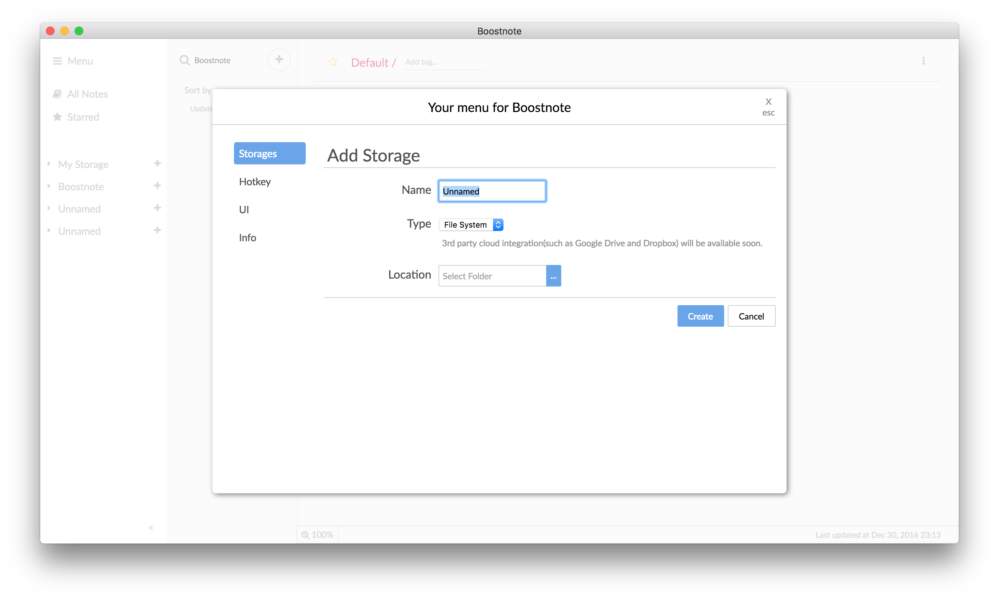
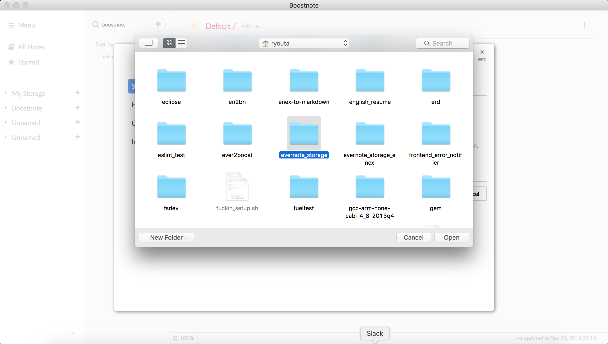
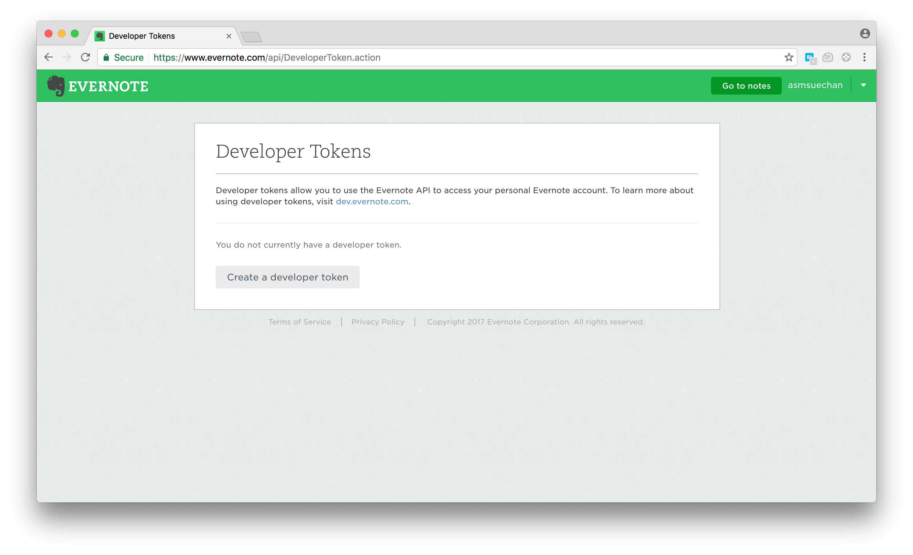

# ever2boost
[](https://travis-ci.org/BoostIO/ever2boost)

ever2bost is a CLI tool for conversion Evernote to Boostnote.

<div align='center'>
  
</div>

# Quick start
Get Evernote developer token from [here](https://www.evernote.com/api/DeveloperToken.action).

```
$ gem install ever2boost
$ ever2boost import
DEVELOPER_TOKEN: <input your developer token>
```

## Connect to your Boostnote
You need to connect it to Boostnote. Go Menu -> Add Storage and add it.



And select your storage. It's at `~/evernote_storage` by default on `import`, `~/evernote_storage_enex` by default on `convert`.



****

## ever2boost command
Ever2boost has 2 commands for conversion `convert` and `import`.

```
$ ever2boost -h
Commands:
  ever2boost convert         # convert from .enex
  ever2boost help [COMMAND]  # Describe available commands or one specific co...
  ever2boost import          # import from evernote
```

### Create notes storage from Evernote
First, you need to create new Boostnote storage by ever2boost. And you can choose which command do you use, `import` or `convert`.

#### import
Import all of notes from cloud storage at Evernote.

`import` command has 1 option `d` which specify output directory.

```
$ ever2boost help import
Usage:
  ever2boost import

Options:
  d, [--directory=DIRCTORY_PATH]  # make Boostnote storage in the directory default: ~/evernote_storage

import from evernote
```

1. get your developer token from https://www.evernote.com/api/DeveloperToken.action


2. run `ever2boost import`

```
$ ever2boost import
DEVELOPER_TOKEN: <input your developer token>
```
And `import` will start. It uses EvernoteAPI, thus you should take care access limitations.

#### convert
Convert notes from `.enex` file which is exported file from Evernote.

`convert` has 1 option `d` which specify output directory.

```
$ ever2boost help convert
Usage:
  ever2boost convert

Options:
  d, [--directory=DIRCTORY_PATH]  # make Boostnote storage in the directory default: ~/evernote_storage

convert from .enex
```

## Requirements
Ruby: 2.0.0 or above  
bundler: Corresponding to Ruby

if you don't have bundler:

```
$ gem install bundler
```

> if it fails by permission, you can run as sudo (perhaps you're using preinstalled Ruby in the OS)


## Something happens
If your Boostnote would be broken:

* Notes and folders disappear
* Folder names are something wrong (e.g: Unknown 1)

First of all, look over [this document](docs/emergency.md). After that, if you would not find how to solve your error, please report an issue.

## Contributing
Bug reports and pull requests are welcome on GitHub at https://github.com/BoostIO/ever2boost.

More information: [how_to_develop_ever2boost](docs/development.md)

## License

The gem is available as open source under the terms of the [MIT License](http://opensource.org/licenses/MIT).
