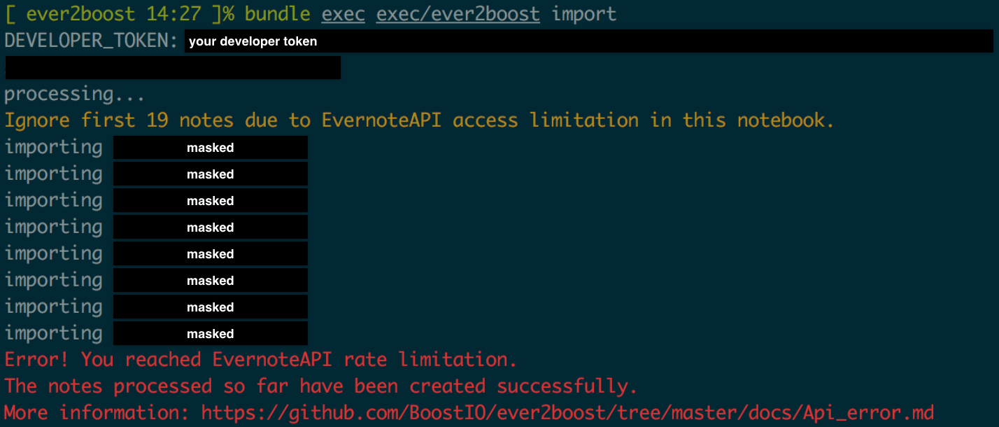

# EvernoteAPI
ever2boost uses EvernoteAPI, therefore there are some limitations.

## Limitations
* [<font color="orange">Warning</font>] Up to **250** notes in each folder

When the folder which ever2boost try to import has over 250 notes, ever2boost downloads first 250 notes from latest. For example, when a folder has 260 notes, the rest 10 old notes are ignored. Then the warning is appear:

```
Ignore first 10 notes due to EvernoteAPI access limitation in this notebook.
```

You need to try `convert` command if you just want to import the folder.

* [<font color="orange">Fatal</font>] Up to **500** notes on import

When it happens, ever2boost tells us an error below:


Actually I don't know the **exact** terms of number of notes, I just experienced in my environment. And **the limitation is reset every hour**. Further more, I've confirmed the error happens in case of capacity limit.

**IMPORTANT**: The import is success (until the limitation) unless the error happens, thus you can connect the directory to Boostnote normaly.

## References
* [Rate Limites](https://dev.evernote.com/doc/articles/rate_limits.php)
* [Rate Limit Best Practices](https://dev.evernote.com/doc/articles/rate_limit_best_practices.php)
